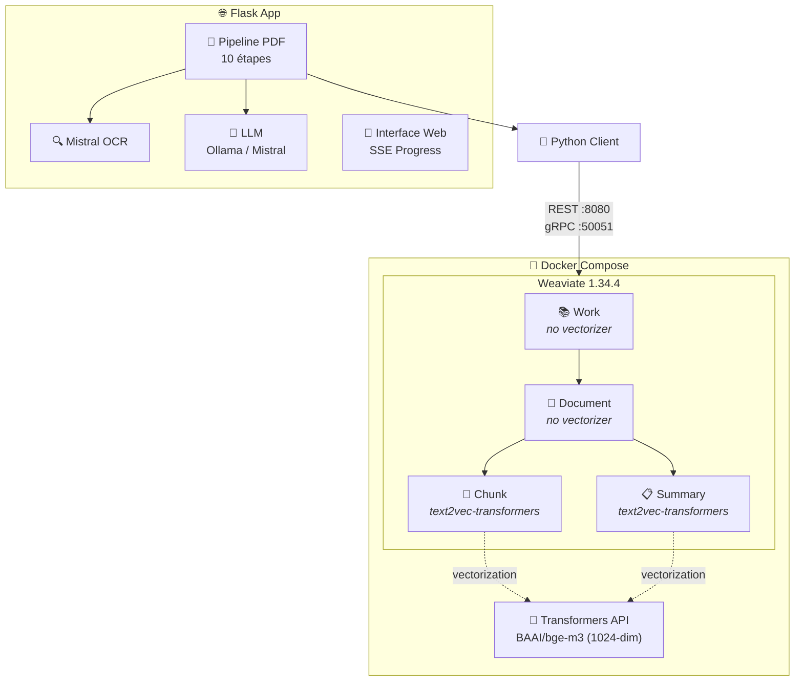
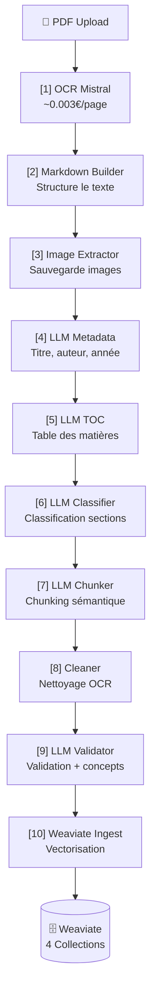

# Library RAG - Base de Textes Philosophiques

Système RAG (Retrieval Augmented Generation) de qualité production spécialisé dans l'indexation et la recherche sémantique de textes philosophiques et académiques. Pipeline complet d'OCR, extraction de métadonnées, chunking intelligent et vectorisation automatique.

> **Note Technique (Dec 2024):** Migration vers BAAI/bge-m3 (1024-dim, 8192 token context) pour un support multilingue supérieur (grec, latin, français, anglais) et des performances améliorées sur les textes philosophiques. Voir [Annexe: Migration BGE-M3](#annexe-migration-bge-m3).

---

## 🚀 Démarrage Rapide

```bash
# 1. Configurer les variables d'environnement
cp .env.example .env
# Éditer .env et ajouter votre MISTRAL_API_KEY

# 2. Démarrer Weaviate + transformers
docker compose up -d

# 3. Installer les dépendances Python
pip install -r requirements.txt

# 4. Créer le schéma Weaviate
python schema.py

# 5. Lancer l'interface web Flask
python flask_app.py
```

Ouvrez ensuite http://localhost:5000 dans votre navigateur.

---

## 📖 Table des Matières

- [Architecture](#-architecture)
- [Pipeline de Traitement PDF](#-pipeline-de-traitement-pdf-10-étapes)
- [Configuration](#%EF%B8%8F-configuration)
- [Interface Flask](#-interface-flask)
- [Schéma Weaviate](#-schéma-weaviate-4-collections)
- [Exemples de Requêtes](#-exemples-de-requêtes)
- [MCP Server (Claude Desktop)](#-mcp-server-claude-desktop)
- [Gestion des Coûts](#-gestion-des-coûts)
- [Tests](#-tests)
- [Debugging](#-debugging)
- [Production](#-production)
- [Annexes](#-annexes)

---

## 🏗️ Architecture



**Composants Clés:**
- **Weaviate 1.34.4**: Base vectorielle avec 4 collections (Work, Document, Chunk, Summary)
- **BAAI/bge-m3**: Modèle d'embedding multilingue (1024 dimensions, 8192 token context)
- **Mistral OCR**: Extraction texte/images (~0.003€/page)
- **LLM**: Ollama (local, gratuit) ou Mistral API (rapide, payant)
- **Flask 3.0**: Interface web avec Server-Sent Events (SSE)

---

## 📄 Pipeline de Traitement PDF (10 Étapes)

Le système implémente un pipeline intelligent orchestré par `utils/pdf_pipeline.py` :



### Détails du Pipeline

| Étape | Module | Fonction | Coût |
|-------|--------|----------|------|
| **1** | `ocr_processor.py` | Extraction texte/images via Mistral OCR | ~0.003€/page |
| **2** | `markdown_builder.py` | Construction Markdown structuré | Gratuit |
| **3** | `image_extractor.py` | Sauvegarde images dans `output/images/` | Gratuit |
| **4** | `llm_metadata.py` | Extraction métadonnées (titre, auteur, langue, année) | Variable (LLM) |
| **5** | `llm_toc.py` | Extraction hiérarchique de la table des matières | Variable (LLM) |
| **6** | `llm_classifier.py` | Classification sections (main_content, preamble, etc.) | Variable (LLM) |
| **7** | `llm_chunker.py` | Découpage sémantique en unités argumentatives | Variable (LLM) |
| **8** | `llm_cleaner.py` | Nettoyage artéfacts OCR, validation longueur | Gratuit |
| **9** | `llm_validator.py` | Validation chunks + extraction concepts/mots-clés | Variable (LLM) |
| **10** | `weaviate_ingest.py` | Ingestion batch + vectorisation automatique | Gratuit |

**Progression en Temps Réel:** Server-Sent Events (SSE) pour suivre chaque étape du traitement via l'interface web.

---

## ⚙️ Configuration

### Variables d'Environnement

Créez un fichier `.env` à la racine du projet :

```env
# API Mistral (obligatoire pour OCR)
MISTRAL_API_KEY=your_mistral_api_key_here

# LLM Configuration
STRUCTURE_LLM_MODEL=qwen2.5:7b             # Modèle Ollama (ou modèle Mistral)
OLLAMA_BASE_URL=http://localhost:11434    # URL serveur Ollama
STRUCTURE_LLM_TEMPERATURE=0.2             # Température LLM (0=déterministe, 1=créatif)

# APIs optionnelles (non utilisées actuellement)
ANTHROPIC_API_KEY=your_anthropic_key      # Optionnel
OPENAI_API_KEY=your_openai_key            # Optionnel

# Weaviate (defaults)
WEAVIATE_HOST=localhost
WEAVIATE_PORT=8080

# Linear Integration (pour développement dans framework)
LINEAR_TEAM=LRP                           # Identifiant équipe Linear
```

### Options de Traitement

Lors de l'upload d'un PDF, vous pouvez configurer :

| Option | Par défaut | Description |
|--------|------------|-------------|
| `skip_ocr` | `False` | Réutiliser markdown existant (évite coût OCR) |
| `use_llm` | `True` | Activer les étapes LLM (métadonnées, TOC, chunking) |
| `llm_provider` | `"ollama"` | `"ollama"` (local, gratuit) ou `"mistral"` (API, rapide) |
| `llm_model` | `None` | Nom du modèle (auto-détecté depuis .env si None) |
| `use_ocr_annotations` | `False` | OCR avec annotations (3x coût, meilleure TOC) |
| `use_semantic_chunking` | `False` | Chunking LLM (lent mais précis) |
| `ingest_to_weaviate` | `True` | Insérer les chunks dans Weaviate |

---

## 📊 Schéma Weaviate (4 Collections)

### Architecture Simplifiée

```
Work (no vectorizer)
  ├─ title, author, year, language, genre
  │
  └─► Document (no vectorizer)
        ├─ sourceId, edition, language, pages, chunksCount
        ├─ toc (JSON), hierarchy (JSON), createdAt
        ├─ work: {title, author} (nested)
        │
        ├─► Chunk (VECTORIZED ⭐)
        │     ├─ text (vectorized), summary (vectorized), keywords (vectorized)
        │     ├─ sectionPath, chapterTitle, unitType, orderIndex, language
        │     ├─ work: {title, author} (nested)
        │     └─ document: {sourceId, edition} (nested)
        │
        └─► Summary (VECTORIZED ⭐)
              ├─ text (vectorized), concepts (vectorized)
              ├─ sectionPath, title, level, chunksCount
              └─ document: {sourceId} (nested)
```

### Collections

**Work** (no vectorizer)
- Représente une œuvre philosophique (ex: Ménon de Platon)
- Propriétés : `title`, `author`, `originalTitle`, `year`, `language`, `genre`
- Pas de vectorisation (métadonnées uniquement)

**Document** (no vectorizer)
- Représente une édition spécifique d'une œuvre (PDF, traduction)
- Propriétés : `sourceId`, `edition`, `language`, `pages`, `chunksCount`, `toc`, `hierarchy`, `createdAt`
- Référence nested : `work: {title, author}`
- Pas de vectorisation (métadonnées uniquement)

**Chunk ⭐** (text2vec-transformers)
- Fragment de texte optimisé pour la recherche sémantique (200-800 caractères)
- Propriétés vectorisées : `text`, `summary` (résumé LLM du chunk), `keywords`
- Propriétés non-vectorisées : `sectionPath`, `chapterTitle`, `unitType`, `orderIndex`, `language`
- Références nested : `work: {title, author}`, `document: {sourceId, edition}`

**Summary** (text2vec-transformers)
- Résumés LLM de chapitres/sections pour recherche de haut niveau
- Propriétés vectorisées : `text`, `concepts`
- Propriétés non-vectorisées : `sectionPath`, `title`, `level`, `chunksCount`
- Référence nested : `document: {sourceId}`

### Design Patterns

**Nested Objects vs Cross-References:**
- Utilise des objets imbriqués pour éviter les JOINs
- Accès en une seule requête avec métadonnées Work/Document
- Trade-off : Petite duplication contrôlée pour performance maximale

**Vectorisation Sélective:**
- Seuls `Chunk.text/summary/keywords` et `Summary.text/concepts` sont vectorisés
- Métadonnées utilisent `skip_vectorization=True` pour filtrage rapide
- Gain : ~6× moins de calculs vs vectorisation complète

**Index Vectoriel HNSW + RQ (2026-01):**
- **HNSW** (Hierarchical Navigable Small World) : Index optimisé pour recherche rapide
- **RQ** (Rotational Quantization) : Compression des vecteurs (~75% réduction mémoire)
- **Distance** : Cosine similarity (compatible BGE-M3)
- **Performance** : <1% perte de précision, scalable jusqu'à 100k+ chunks

---

## 🌐 Interface Flask

### Routes Disponibles

| Route | Méthode | Description |
|-------|---------|-------------|
| `/` | GET | 🏛️ Accueil — Statistiques des collections |
| `/passages` | GET | 📚 Parcourir — Liste paginée de tous les chunks |
| `/search` | GET | 🔍 Recherche — Recherche sémantique vectorielle |
| `/upload` | GET | 📤 Formulaire — Page d'upload PDF |
| `/upload` | POST | 🚀 Traiter — Démarre le traitement PDF en arrière-plan |
| `/upload/progress/<job_id>` | GET | 📊 SSE — Flux de progression en temps réel |
| `/upload/status/<job_id>` | GET | ℹ️ Statut — État JSON du job de traitement |
| `/upload/result/<job_id>` | GET | ✅ Résultats — Page de résultats du traitement |
| `/documents` | GET | 📁 Documents — Liste des documents traités |
| `/documents/<doc>/view` | GET | 👁️ Détails — Vue détaillée d'un document |
| `/documents/delete/<doc>` | POST | 🗑️ Supprimer — Supprime document + chunks de Weaviate |
| `/output/<filepath>` | GET | 💾 Télécharger — Télécharge fichiers traités (MD, JSON) |

### Server-Sent Events (SSE)

L'interface utilise SSE pour un suivi en temps réel du traitement :

```javascript
// Exemple de flux SSE
event: step
data: {"step": 1, "total": 10, "message": "OCR Mistral en cours...", "progress": 10}

event: step
data: {"step": 4, "total": 10, "message": "Extraction métadonnées (LLM)...", "progress": 40}

event: complete
data: {"success": true, "document": "platon-menon", "chunks": 127, "cost_ocr": 0.12, "cost_llm": 0.03}

event: error
data: {"error": "OCR failed: API timeout"}
```

---

## 🔍 Exemples de Requêtes

### Recherche Sémantique (Collection Chunk)

```python
import weaviate
import weaviate.classes.query as wvq

client = weaviate.connect_to_local()

try:
    chunks = client.collections.get("Chunk")

    # Recherche sémantique simple
    result = chunks.query.near_text(
        query="la mort et la valeur de la vie",
        limit=5,
        return_metadata=wvq.MetadataQuery(distance=True),
    )

    for obj in result.objects:
        work = obj.properties['work']
        doc = obj.properties['document']
        print(f"[{work['title']} - {work['author']}]")
        print(f"  Edition: {doc['edition']}")
        print(f"  Section: {obj.properties['sectionPath']}")
        print(f"  {obj.properties['text'][:200]}...")
        print(f"  Similarité: {(1 - obj.metadata.distance) * 100:.1f}%\n")

finally:
    client.close()
```

### Recherche avec Filtres

```python
# Rechercher dans les œuvres de Platon uniquement
result = chunks.query.near_text(
    query="justice et vérité",
    limit=10,
    filters=wvq.Filter.by_property("work").by_property("author").equal("Platon"),
    return_metadata=wvq.MetadataQuery(distance=True),
)

# Filtrer par langue
result = chunks.query.near_text(
    query="âme immortelle",
    limit=5,
    filters=wvq.Filter.by_property("language").equal("fr"),
)

# Filtrer par type d'unité (arguments uniquement)
result = chunks.query.near_text(
    query="connaissance",
    filters=wvq.Filter.by_property("unitType").equal("argument"),
)
```

### Recherche Hybride (Sémantique + BM25)

```python
# Combine recherche vectorielle et recherche par mots-clés
result = chunks.query.hybrid(
    query="réminiscence et connaissance",
    alpha=0.75,  # 0 = BM25 uniquement, 1 = vectoriel uniquement, 0.75 = favorise vectoriel
    limit=10,
)
```

### Recherche dans les Résumés (High-Level)

```python
summaries = client.collections.get("Summary")

# Recherche de chapitres/sections par concept
result = summaries.query.near_text(
    query="dialectique et maïeutique",
    limit=5,
)

for obj in result.objects:
    print(f"Section: {obj.properties['title']}")
    print(f"Niveau: {obj.properties['level']}")
    print(f"Résumé: {obj.properties['text']}")
    print(f"Concepts: {', '.join(obj.properties['concepts'])}\n")
```

---

## 🤖 MCP Server (Claude Desktop)

Library RAG expose ses fonctionnalités via un serveur MCP (Model Context Protocol) pour intégration avec Claude Desktop.

### Installation MCP

```bash
# Installer les dépendances MCP
pip install -r requirements.txt

# Tester le serveur
python mcp_server.py
```

### Configuration Claude Desktop

Ajouter à votre configuration Claude Desktop :

**Windows:** `%APPDATA%\Claude\claude_desktop_config.json`
**macOS:** `~/Library/Application Support/Claude/claude_desktop_config.json`
**Linux:** `~/.config/Claude/claude_desktop_config.json`

```json
{
  "mcpServers": {
    "library-rag": {
      "command": "python",
      "args": ["C:/path/to/library_rag/mcp_server.py"],
      "env": {
        "MISTRAL_API_KEY": "your-mistral-api-key"
      }
    }
  }
}
```

### Outils MCP Disponibles

**1. parse_pdf** - Traite un PDF avec paramètres optimaux
```
parse_pdf(pdf_path="/docs/platon-menon.pdf")
```

**2. search_chunks** - Recherche sémantique dans les chunks
```
search_chunks(query="la vertu", limit=10, author_filter="Platon")
```

**3. search_summaries** - Recherche dans les résumés de chapitres
```
search_summaries(query="dialectique", min_level=1, max_level=2)
```

**4. get_document** - Récupère un document par ID
```
get_document(source_id="platon-menon", include_chunks=true)
```

**5. list_documents** - Liste tous les documents
```
list_documents(author_filter="Platon", language_filter="fr")
```

**6. get_chunks_by_document** - Récupère les chunks d'un document
```
get_chunks_by_document(source_id="platon-menon", limit=50)
```

**7. filter_by_author** - Tous les travaux d'un auteur
```
filter_by_author(author="Platon")
```

**8. delete_document** - Supprime un document (requiert confirmation)
```
delete_document(source_id="platon-menon", confirm=true)
```

Pour plus de détails, voir la documentation complète dans `.claude/CLAUDE.md`.

---

## 💰 Gestion des Coûts

### Coûts OCR (Mistral API)

| Mode | Coût par page | Utilisation |
|------|---------------|-------------|
| **Standard** | ~0.001-0.003€ | Extraction texte + images |
| **Avec annotations** | ~0.009€ (3x) | + Annotations structurelles (meilleure TOC) |

**Optimisation:** Utilisez `skip_ocr=True` pour réutiliser le Markdown existant et éviter les coûts OCR lors du retraitement.

### Coûts LLM

| Provider | Coût | Performance |
|----------|------|-------------|
| **Ollama** (local) | Gratuit | Plus lent (~30s/doc), nécessite GPU/CPU puissant |
| **Mistral API** | Variable | Rapide (~5s/doc), facturé par token |

**Recommandation:**
- Développement/test : Ollama (gratuit)
- Production : Mistral API (rapide, scalable)

### Suivi des Coûts

Chaque traitement génère un fichier `<doc>_chunks.json` avec :

```json
{
  "cost_ocr": 0.12,
  "cost_llm": 0.03,
  "total_cost": 0.15,
  "pages": 40,
  "chunks": 127
}
```

---

## 🔧 Configuration Docker

Le fichier `docker-compose.yml` configure :

### Weaviate 1.34.4
- **Ports:** 8080 (HTTP), 50051 (gRPC)
- **Modules:** `text2vec-transformers`
- **Persistence:** Volume `weaviate_data`
- **Authentification:** Désactivée (dev local)

### text2vec-transformers
- **Modèle:** `baai-bge-m3-onnx` (BAAI/bge-m3, version ONNX)
- **Dimensions:** 1024 (2.7x plus riche que MiniLM-L6)
- **Context Window:** 8192 tokens (16x plus long que MiniLM-L6)
- **Runtime:** ONNX CPU-optimized (AVX2)
- **Multilingue:** Support supérieur pour grec, latin, français, anglais
- **Worker Timeout:** 600s (pour gérer les chunks très longs)

**Note GPU:** La version ONNX de BGE-M3 est CPU-only (pas de support CUDA natif dans ONNX runtime). Pour l'accélération GPU, il faudrait utiliser NVIDIA NIM (architecture différente).

---

## 🧪 Tests

```bash
# Exécuter tous les tests
pytest

# Tests spécifiques
pytest tests/utils/test_ocr_schemas.py -v

# Avec couverture
pytest --cov=utils --cov-report=html

# Type checking strict
mypy .
```

**Tests disponibles:**
- `test_ocr_schemas.py` : Validation schémas OCR
- `test_toc.py` : Extraction table des matières
- `test_mistral_client.py` : Client API Mistral

---

## 🐛 Debugging

### Problèmes Courants

**1. "Weaviate connection failed"**
```bash
# Vérifier que les conteneurs sont démarrés
docker compose ps

# Démarrer si nécessaire
docker compose up -d

# Vérifier les logs
docker compose logs weaviate
```

**2. "OCR cost too high"**
```python
# Réutiliser markdown existant
result = process_pdf(
    Path("input/document.pdf"),
    skip_ocr=True,  # ← Évite l'OCR
    use_llm=True,
)
```

**3. "LLM timeout (Ollama)"**
```env
# Augmenter timeout ou utiliser modèle plus léger
STRUCTURE_LLM_MODEL=qwen2.5:7b  # Au lieu de deepseek-r1:14b
```

**4. "Empty chunks after cleaning"**
```python
# Vérifier les sections classifiées
import json
with open("output/<doc>/<doc>_chunks.json") as f:
    data = json.load(f)
    print(data["classified_sections"])
```

**5. "TOC extraction failed"**
```python
# Utiliser annotations OCR (plus fiable mais 3x coût)
result = process_pdf(
    Path("input/document.pdf"),
    use_ocr_annotations=True,  # ← Meilleure TOC
)
```

**6. "Le fichier _ocr.json est-il utilisé ?"**

Le fichier `<doc>_ocr.json` est créé systématiquement mais :
- **Pipeline normal:** ❌ Non utilisé (réponse OCR en mémoire → markdown)
- **Mode `skip_ocr=True`:** ✅ Lu uniquement pour récupérer le nombre de pages

**Utilité:** Archive en production, cache en développement pour éviter les coûts API.

### Logs

```python
import logging

# Activer logs détaillés
logging.basicConfig(level=logging.DEBUG)

# Logs pipeline
logger = logging.getLogger("utils.pdf_pipeline")
logger.setLevel(logging.DEBUG)
```

---

## 🚀 Production

### Checklist Déploiement

- [ ] **Sécurité:** Ajouter authentification Flask (Flask-Login, OAuth)
- [ ] **Rate Limiting:** Limiter uploads (Flask-Limiter)
- [ ] **Secrets:** Utiliser gestionnaire secrets (AWS Secrets Manager, Vault)
- [ ] **HTTPS:** Configurer reverse proxy (nginx + Let's Encrypt)
- [ ] **CORS:** Configurer CORS si API séparée
- [ ] **Monitoring:** Logging centralisé (Sentry, CloudWatch)
- [ ] **Coûts:** Dashboard suivi coûts OCR/LLM
- [ ] **Backup:** Stratégie backup Weaviate (volumes Docker)
- [ ] **Tests:** Suite tests complète (pytest + couverture >80%)
- [ ] **CI/CD:** Pipeline automatisé (GitHub Actions, GitLab CI)

### Exemple Nginx

```nginx
server {
    listen 80;
    server_name library-rag.example.com;

    location / {
        proxy_pass http://127.0.0.1:5000;
        proxy_set_header Host $host;
        proxy_set_header X-Real-IP $remote_addr;
    }

    # SSE requiert des timeouts longs
    location /upload/progress {
        proxy_pass http://127.0.0.1:5000;
        proxy_buffering off;
        proxy_read_timeout 600s;
    }
}
```

### Production WSGI

```bash
# Installer Gunicorn
pip install gunicorn

# Lancer avec workers
gunicorn -w 4 -b 0.0.0.0:5000 --timeout 600 flask_app:app
```

---

## 📁 Structure du Projet

```
library_rag/
├── .env                        # Variables d'environnement (API keys, config LLM)
├── .env.example                # Exemple de configuration
├── docker-compose.yml          # Weaviate + text2vec-transformers
├── requirements.txt            # Dépendances Python
├── mypy.ini                    # Configuration mypy (strict mode)
├── pytest.ini                  # Configuration pytest
│
├── schema.py                   # ⚙️ Définition schéma Weaviate (4 collections)
├── flask_app.py                # 🌐 Application Flask principale (38 Ko)
├── mcp_server.py               # 🤖 MCP server pour Claude Desktop
├── query_test.py               # 🔍 Exemples de requêtes sémantiques
│
├── utils/                      # 📦 Modules du pipeline PDF
│   ├── __init__.py
│   ├── types.py                # TypedDict centralisées (31 Ko)
│   ├── pdf_pipeline.py         # Orchestration pipeline 10 étapes (64 Ko)
│   ├── mistral_client.py       # Client API Mistral OCR
│   ├── pdf_uploader.py         # Upload PDF vers Mistral
│   ├── ocr_processor.py        # Traitement OCR
│   ├── ocr_schemas.py          # Types pour réponses OCR
│   ├── markdown_builder.py     # Construction Markdown
│   ├── image_extractor.py      # Extraction images
│   ├── hierarchy_parser.py     # Parsing hiérarchique
│   ├── llm_structurer.py       # Infrastructure LLM (Ollama/Mistral)
│   ├── llm_metadata.py         # LLM: Extraction métadonnées
│   ├── llm_toc.py              # LLM: Extraction TOC
│   ├── llm_classifier.py       # LLM: Classification sections
│   ├── llm_chunker.py          # LLM: Chunking sémantique
│   ├── llm_cleaner.py          # Nettoyage chunks
│   ├── llm_validator.py        # LLM: Validation + concepts
│   ├── llm_summarizer.py       # LLM: Génération résumés chunks (optionnel)
│   ├── weaviate_ingest.py      # Ingestion batch Weaviate
│   ├── generate_chunk_summaries.py  # Script génération résumés par batch
│   ├── generate_all_summaries.py    # Script génération pour tous les docs
│   ├── toc_extractor.py        # Extraction TOC (stratégies alternatives)
│   ├── toc_extractor_markdown.py
│   └── toc_extractor_visual.py
│
├── mcp_tools/                  # 🔧 MCP tool implementations
│   ├── parse_pdf.py
│   └── search.py
│
├── templates/                  # 🎨 Templates Jinja2
│   ├── base.html               # Template de base (navigation, CSS)
│   ├── index.html              # Page d'accueil (statistiques)
│   ├── passages.html           # Liste paginée des chunks
│   ├── search.html             # Interface de recherche sémantique
│   ├── upload.html             # Formulaire d'upload PDF
│   ├── upload_progress.html    # Progression SSE en temps réel
│   ├── upload_result.html      # Résultats du traitement
│   ├── documents.html          # Liste des documents traités
│   └── document_view.html      # Vue détaillée d'un document
│
├── static/
│   └── rag-philo-charte.css    # 🎨 Charte graphique
│
├── input/                      # 📄 PDFs à traiter
│   └── (vos fichiers PDF)
│
├── output/                     # 💾 Résultats du traitement
│   └── <nom_document>/
│       ├── <nom_document>.md             # Markdown structuré
│       ├── <nom_document>_chunks.json    # Chunks + métadonnées
│       ├── <nom_document>_ocr.json       # Réponse OCR brute
│       ├── <nom_document>_weaviate.json  # Résultat ingestion
│       └── images/                       # Images extraites
│           ├── page_001_image_0.png
│           └── ...
│
├── tests/                      # 🧪 Tests unitaires
│   └── utils/
│       ├── test_ocr_schemas.py
│       ├── test_toc.py
│       └── test_mistral_client.py
│
├── .claude/                    # 🤖 Instructions pour Claude Code
│   └── CLAUDE.md
│
└── README.md                   # 📖 Ce fichier
```

---

## 📚 Ressources

### Documentation

- [Weaviate Documentation](https://weaviate.io/developers/weaviate)
- [Weaviate Python Client v4](https://weaviate.io/developers/weaviate/client-libraries/python)
- [text2vec-transformers](https://weaviate.io/developers/weaviate/modules/retriever-vectorizer-modules/text2vec-transformers)
- [Mistral AI API](https://docs.mistral.ai/)
- [Ollama Documentation](https://ollama.ai/)
- [Model Context Protocol (MCP)](https://modelcontextprotocol.io/)

### Développement

- `.claude/CLAUDE.md` - Instructions développement pour Claude Code
- `utils/types.py` - Définitions TypedDict centralisées (31 Ko)
- `mypy.ini` - Configuration vérification types stricte

### Modèles

- **BAAI/bge-m3:** Modèle d'embedding multilingue (1024 dimensions, 8192 token context)
- **Qwen 2.5:** Modèle LLM recommandé pour extraction (via Ollama)
- **Mistral API:** OCR + LLM cloud (rapide, payant)

---

## 📝 Licence

Ce projet est un outil de recherche académique. Consultez votre licence spécifique.

---

## 🤝 Contribution

Pour contribuer :

1. **Type Safety:** Toutes les fonctions doivent avoir des annotations de types
2. **Docstrings:** Google-style docstrings obligatoires
3. **Tests:** Ajouter tests unitaires pour nouvelles fonctionnalités
4. **mypy:** Code doit passer `mypy --strict`
5. **Simplicité:** Suivre principes KISS et YAGNI

```bash
# Vérifier types
mypy .

# Vérifier docstrings
pydocstyle utils/

# Tests
pytest
```

---

## 📌 Annexes

### Annexe: Migration BGE-M3

**Date:** Décembre 2024

**Raison:** Migration de MiniLM-L6 (384-dim) vers BAAI/bge-m3 (1024-dim) pour :
- 2.7× représentation sémantique plus riche
- 8192 token context (vs 512)
- Support multilingue supérieur (grec, latin, français, anglais)
- Meilleures performances sur textes philosophiques/académiques

**Impact:**
- **Aucun changement** dans le pipeline (étapes 1-9)
- **Modification** de la vectorisation (étape 10) : utilise BGE-M3
- **Collections Weaviate** : Recréées avec vecteurs 1024-dim
- **Documents existants** : Doivent être ré-ingérés

**Migration:**
```bash
# 1. Arrêter containers
docker compose down

# 2. Démarrer avec nouvelle config
docker compose up -d

# 3. Recréer schéma
python schema.py

# 4. Ré-ingérer documents depuis cache
python reingest_from_cache.py
```

**Rollback:** Restaurer `docker-compose.yml.backup` si nécessaire (~15 min).

**Note Technique:** La version ONNX de BGE-M3 est CPU-only (pas de VRAM utilisée). Pour l'accélération GPU, il faudrait utiliser NVIDIA NIM (architecture différente).

---

**Library RAG** - Système RAG de qualité production pour textes philosophiques et académiques.
